## Tasks


### Tasks
```java
try {
	int a = 1/0;
}
finally {
	System.out.println("Finaly block");
}
```

Що буде результатом виконання даного коду:

1. Код не скомпілюється
2. java.lang.ArithmeticException
3. Finaly block, java.lang.ArithmeticException


### Tasks
```java
try {
	int a = 1/0;
}
catch(Exception e) {
	System.out.println("Generic exception");
}
catch(ArithmeticException e) {
	System.out.println("ArithmeticException");
}
```

Що буде результатом виконання даного коду:
1. Код не скомпілюється
2. Generic exception
3. ArithmeticException


### Tasks
```java
try {
	int a = 1/0;
}
catch(ArithmeticException e) {
	System.out.println("catch block");
}
finally {
	throw new ArithmeticException("/ by zero");
}
```

Що буде результатом виконання даного коду:
1. Код не скомпілюється
2. catch block, ArithmeticException / by zero
3. catch block
4. ArithmeticException / by zero


### Tasks
```java
private void work() {
	try {
		work();
	} finally {
		work();
	}
}
```

1. StackOverflowError
2. NullPointerException
3. Зависне
4. Все ок


### Tasks
Чи є даний інтерфейс функціональним:

```java
interface Some {
	default void test() {
		System.out.println("Testing");
	}
	
	static void run() {
		
	}
	
	void grid(Integer a);
}
```


## GC


### GC
```cpp
int
send_request()
{
  size_t n = read_size();

  int* elements = malloc(n * sizeof(int));

  if (read_elements(n, elements) < n){
      return -1;
  }

  return 0;
}
```

Цей код містить потенційний memory leak. Так-як нам вручну потрібно звільнити пам'ять ``` free(elements)```.


### GC
Пишучи на Java, про memory leak потрібно хвилюватися набагато менше, тому що java використовує Garbage collector.

> Збирання сміття (англ. garbage collection) — одна з форм автоматичного керування оперативною пам'яттю комп'ютера під час виконання програм. Підпрограма — «прибиральник сміття» — вивільняє пам'ять від об'єктів, які не будуть використовуватись програмою в подальшому.


### GC
Хоча наявність GC не дає 100% гарантію відсутності memory leak.

> Наприклад, до Java 7 метод substring класу String міг викликати memory leak.


### GC
GC для своєї роботи будує граф об'єктів. GC проходить по графові знаходить об'єкти до яких не можна добратись і знищує їх.

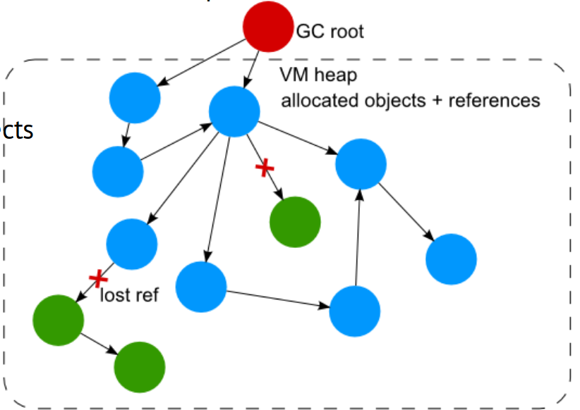


### GC
**Що таке мусор**

> Мусор - це об'єкт на який ніхно не посилається.

Просте визначення, але нажаль не все так просто.


### GC
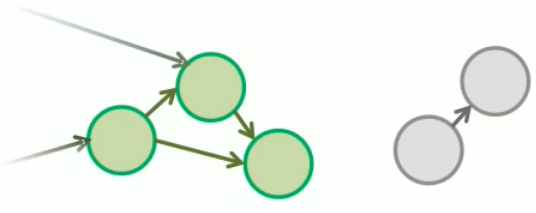


### GC
- Складно визначити, що таке мусор використовуючи характеристики "хто на кого посилається".
- Мусором є об'єкти, які не можуть використовуватися програмой
- Питання: А які об'єкти можуть використовуватися?


### GC
Не мусором є:

1. Об'єкти в статичних полях
2. Об'єкти в локальних змінних, які доступні із фрейма методів (локальні змінні і стек операндів) стека виклику всіх Java потоків.
3. Об'єкти, на які посилається не мусор


### GC
Java GC базується на наступній гіпотезі:

> Більшість об'єктів скоро стануть недоступні. Посилання із "старих" об'єктів на "нові" існують в малій кількості.


### GC
GC має три стадії:

- Mark: GC проходе по графові об'єктів і визначає,я кі об'єкти є мусором
- Delete/sweep: Знищення мусора
- Compactiong: Фрагментація пам'яті, так щоб об'єкти лижали безперервно


### GC
Java GC - generational collector.

Це означає, що відбувається поділ об'єктів в залежності від часу створення і їх життя.


### GC
Heap поділений на 2 простори:

- Young generation: місце, де живуть молоді об'єкти
- Old(Tenured) generation: місце, де живуть старі об'єкти


### GC
Young generation в свою чергу поділений на 3 простори:

- Eden space: місце де живуть, щойно створені обєкти
- Survivor space from/Survivor space to: Якщо в edem немає місця, gc проходиться по edem і знищує місор, всі, що залишилися переходять в Survivor space


### GC
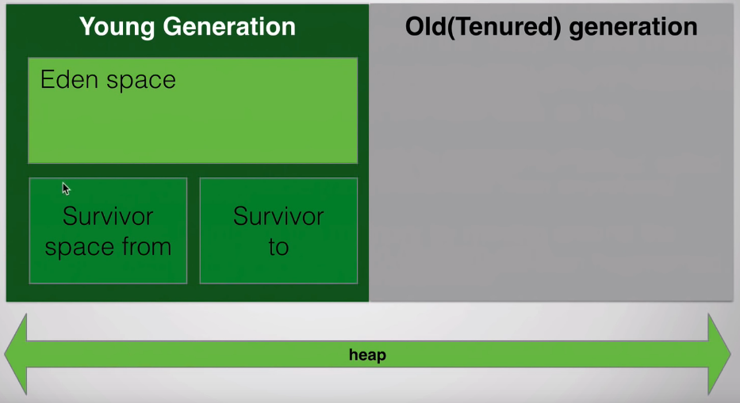


### GC
Коли в heap закінчється простір, можуть запуститися 3 різновиди GC:

- Minor: чистить young generation
- Major: чистить old generation
- Full: чистить young і old


### GC

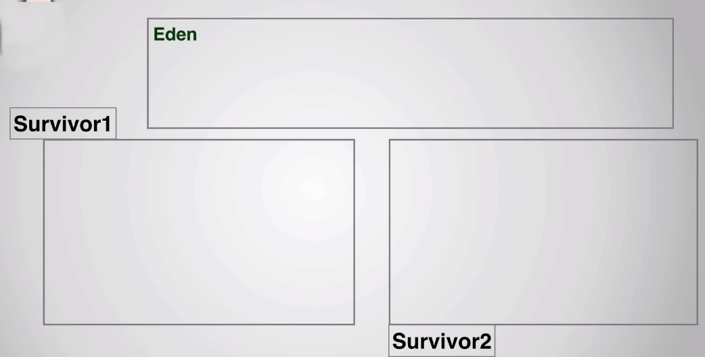


### GC


### GC
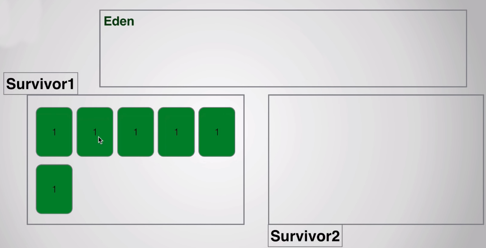


### GC
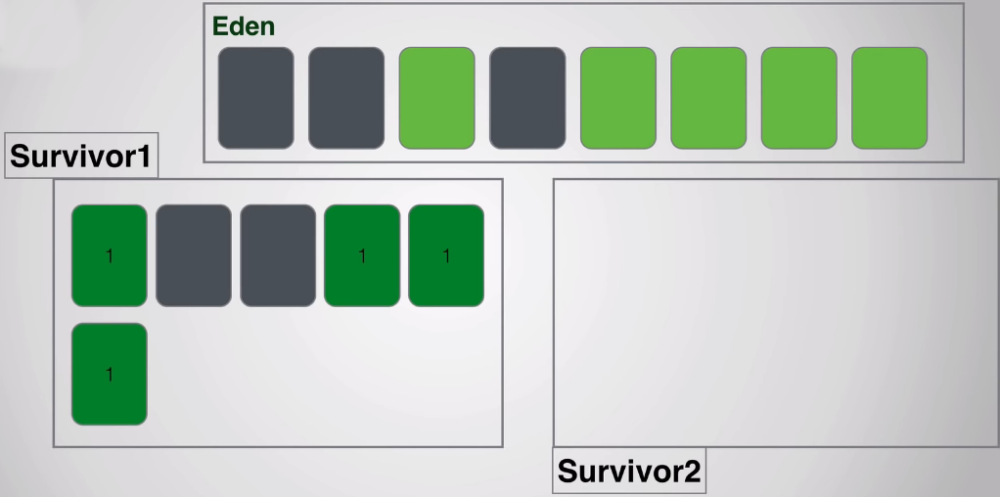


### GC
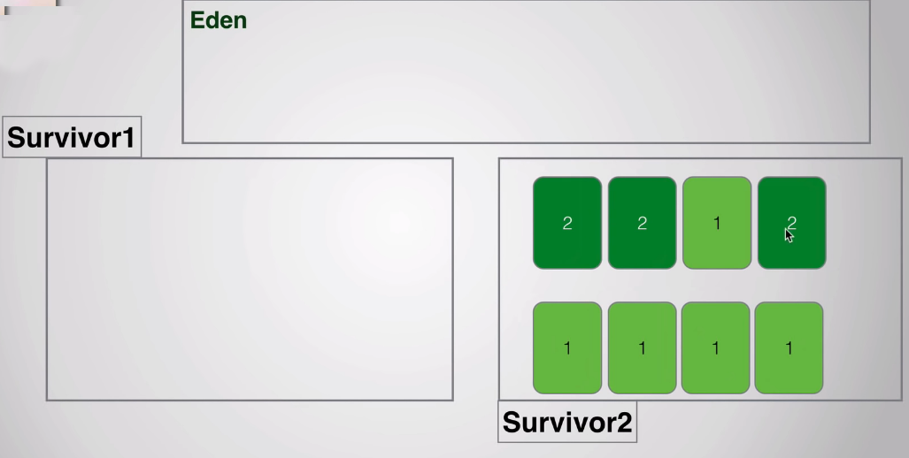


### GC


### GC
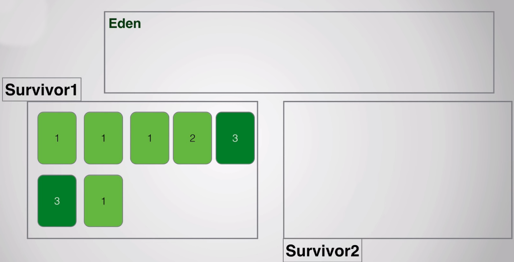


### GC
Переміщення між Survivor from до Survivor to, будуть відбуватися доки об'єкт не досягне певного значення, наприклад 16.


### GC
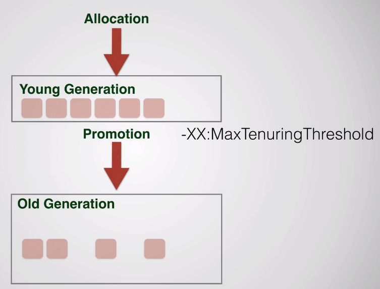


### GC
Види GC:

- Serial collector: працює в тому потоці, що і додаток
- Concurrent collector: працює в іншому потоці. "Stop the world" на етапі mark/re-mark
- parallel collector: Використовує багато потоків і ядер для своєї роботи. Працює лише коли heap повний. "stops the world" коли працює


### GC
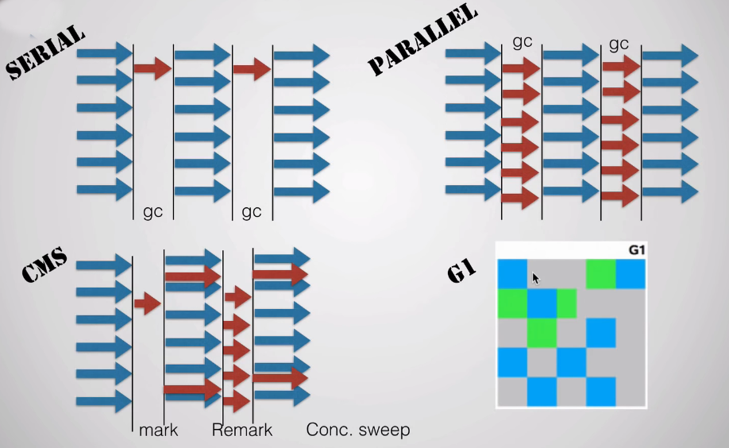


### GC

Використовуйте concurent collector: 

- багато пам'яті
- багато CPU
- Додаток повинен зупинятися якомога менше


### GC

Використовуйте parallel collector: 

- мало пам'яті
- мало CPU
- додаток не вразливий до пауз


### GC
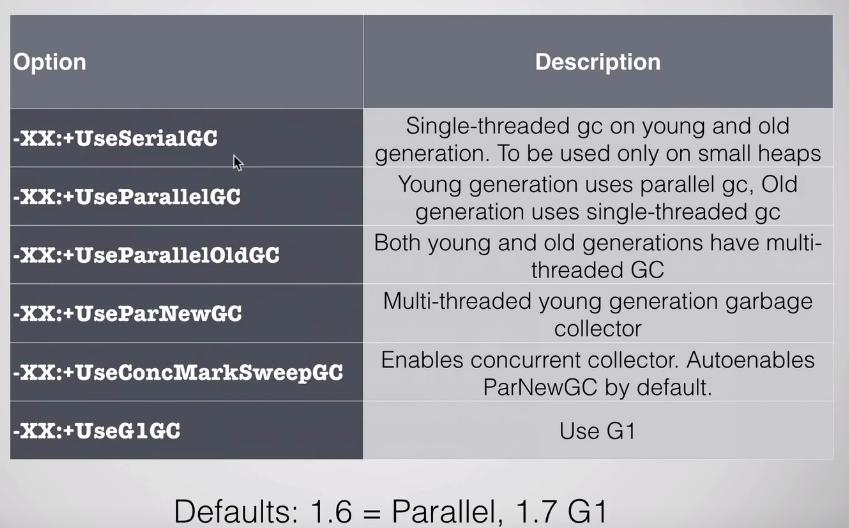


### GC

finalizer:

```java
protected void finalize() throws Throwable
```

- Виконайється коли об'єкт знищуватиметься
- Нема упевненості, коли об'єкт буде знищено
- JDK 9, finilize deprecated


## Reflection API


### Reflection API
**Рефлексія** (від Reflexio - звернення назад) - це механізм дослідження даних про програму у час, коли вона виконується.


### Reflection API
Рефлексія дозволяє:
- Визначити клас об'єкта.
- Отримати інформацію про модифікатори класу, поля, методи, конструктори і суперклас.
- З'ясувати, які константи і методи належать інтерфейсу.
- Створити екземпляр класу, ім'я якого невідоме до моменту виконання програми.
- Отримати і встановити значення властивостей об'єкта.
- Викликати метод об'єкта.
- Створити новий масив, розмір і тип компонентів якого невідомі до моменту виконання програм.


### Reflection API. Отримання об'єкта типу Class
Найпростіше, що зазвичай роблять в динамічному програмуванні, - це отримують об'єкт типу java.lang.Class. Якщо у нас є екземпляр об'єкта Class ми можемо отримати всіляку інформацію про це класі і навіть здійснювати операції над ним.

```java
MyClass a = new MyClass(); 
Class aclass = a.getClass(); 
```


### Reflection API. Отримання об'єкта типу Class
Вищенаведений метод getClass () часто корисний тоді коли є екземпляр об'єкта, але не відомо якого класу цей екземпляр. Якщо у нас є клас, для якого в момент компіляції відомий тип, то отримати екземпляр класу ще простіше.

```java
Class aclass = MyClass.class; 
Class iclass = Integer.class; 
```


### Reflection API. Отримання об'єкта типу Class
Якщо ім'я класу не відомо в момент компіляції, але стає відомим під час виконання програми, можна використовувати метод forName (), щоб отримати об'єкт Class.

```java
Class c = Class.forName("com.mysql.jdbc.Driver");
```


### Reflection API. Отримання імені класу
```java
package demo;

class MyClass {}

public class Main {

	public static void main(String[] args) {
		MyClass class1 = new MyClass();
		Class klass = class1.getClass();
		String s = klass.getName();
		System.out.println(s);
	}
}
```

Об'єкт типу String, що повертається методом getName (), буде містити повністю уточнене ім'я класу.


### Reflection API. Отримання імені класу


### Reflection API. Визначення модифікаторів класу
```java
import java.lang.reflect.Modifier;

final class MyClass {}

public class Main {

	public static void main(String[] args) {
		MyClass class1 = new MyClass();
		Class klass = class1.getClass();
		String s = klass.getName();
		int mods = klass.getModifiers();
		System.out.println(mods);
		if (Modifier.isPublic(mods)) { 
		    System.out.println("public"); 
		} 
		if (Modifier.isAbstract(mods)) { 
		    System.out.println("abstract"); 
		} 
		if (Modifier.isFinal(mods)) { 
		    System.out.println("final"); 
		} 
	}
}
```


### Reflection API. Визначення модифікаторів класу


### Reflection API. Отримання суперкласу
```java
final class MyClass {}

public class Main {

	public static void main(String[] args) {
		MyClass class1 = new MyClass();
		Class klass = class1.getClass();
		Class super_class = klass.getSuperclass();
		System.out.println(super_class.getName());
	}
}
```


### Reflection API. Отримання суперкласу


### Reflection API. Отримання суперкласу
- Потрібно не забувати враховувати, що в Java відсутня множинне успадкування і клас java.lang.Object є базовим класом для всіх класів, внаслідок чого якщо у класу немає батька то метод getSuperclass поверне null.
- Для того щоб отримати всі батьківські суперкласу, потрібно рекурсивно викликати метод getSuperclass


### Reflection API. Визначення інтерфейсів, які реалізує класс
```java
import java.util.LinkedList;

public class Main {

	public static void main(String[] args) {
		Class c =  LinkedList.class; 
		Class[] interfaces = c.getInterfaces(); 
		for(Class cInterface : interfaces) { 
		    System.out.println( cInterface.getName() ); 
		} 
	}
}
```


### Reflection API. Визначення інтерфейсів, які реалізує класс


### Reflection API. Отримання інформації про поля класу
```java
import java.lang.reflect.Field;

class Student {
	private String name = "Alex";
	public int age = 22;
}

public class Main {

	public static void main(String[] args) {
		Student s = new Student();
		Class c = s.getClass(); 
		Field[] publicFields = c.getFields(); 
		for (Field field : publicFields) { 
		    Class fieldType = field.getType(); 
		    System.out.println("Name: " + field.getName()); 
		    System.out.println("Type: " + fieldType.getName()); 
		} 
	}
}
```


### Reflection API. Отримання інформації про поля класу


### Reflection API. Отримання інформації про поля класу
Якщо відоме ім'я поля, то можна отримати про нього інформацію за допомогою методу getField ()

```java
Class c = obj.getClass(); 
Field nameField = c.getField("name"); 
```


### Reflection API. Отримання інформації про поля класу
- Методи getField () і getFields () повертають тільки відкриті члени даних класу. Якщо потрібно отримати всі поля деякого класу потрібно використовувати методи getDeclaredField () і getDeclaredFields ().
- Щоб отримати значення поля, потрібно спочатку отримати для цього поля об'єкт типу Field потім використовувати метод get (). Метод приймає вхідним параметром посилання на об'єкт класу. Так само у класу Field є спеціалізовані методи для отримання значень примітивних типів: getInt (), getFloat (), getByte () і ін ..


### Reflection API. Отримання інформації про поля класу
```java
import java.lang.reflect.Field;

class Student {
	private String name = "Alex";
	public int age = 22;
}

public class Main {

	public static void main(String[] args) throws NoSuchFieldException, SecurityException, IllegalArgumentException, IllegalAccessException {
		Student s = new Student();
		Class c = s.getClass(); 
		Field ageField = c.getDeclaredField("age");
		int age = ageField.getInt(s);
		System.out.println(age);
	}
}
```


### Reflection API. Отримання інформації про поля класу


### Reflection API. Отримання інформації про поля класу
Для установки значення поля, використовується метод set (). Для примітивних типів є методи setInt (), setFloat (), setByte () і ін.

```java
import java.lang.reflect.Field;

class Student {
	private String name = "Alex";
	public String getName() {
		return this.name;
	}
	public int age = 22;
}

public class Main {

	public static void main(String[] args) throws NoSuchFieldException, SecurityException, IllegalArgumentException, IllegalAccessException {
		Student s = new Student();
		Class c = s.getClass(); 
		Field nameField = c.getDeclaredField("name");
		nameField.setAccessible(true);
		nameField.set(s, "John");
		nameField.setAccessible(false);
		System.out.println(s.getName());
	}
}
```


### Reflection API. Отримання інформації про поля класу


### Reflection API. Отримання інформації про поля класу
```java
import java.lang.reflect.Constructor;

class Student {
	public Student(String name) {}
	public Student(String name, int age) {}
}

public class Main {

	public static void main(String[] args) throws NoSuchFieldException, SecurityException, IllegalArgumentException, IllegalAccessException {
		Student s = new Student("qwe");
		Class c = s.getClass(); 
		Constructor[] constructors = c.getConstructors(); 
		for (Constructor constructor : constructors) { 
		    Class[] paramTypes = constructor.getParameterTypes(); 
		    for (Class paramType : paramTypes) { 
		        System.out.print(paramType.getName() + " "); 
		    } 
		    System.out.println(); 
		} 
	}
}
```


### Reflection API. Отримання інформації про поля класу


### Reflection API. Отримання інформації про поля класу
Методи getConstructor () і getConstructors () повертають тільки відкриті конструктори. Якщо потрібно отримати всі конструктори класу, включаючи закриті можна використовувати методи getDeclaredConstructor () і getDeclaredConstructors () ці методи працюють точно також, як їх аналоги getConstructor () і getConstructors ().


### Reflection API. Отримання інформації про поля класу
```java
Class c = obj.getClass(); 
Method[] methods = c.getMethods(); 
for (Method method : methods) { 
    System.out.println("name: " + method.getName()); 
    System.out.println("type: " + method.getReturnType().getName()); 
 
    Class[] paramTypes = method.getParameterTypes(); 
    System.out.print("types of parameters: "); 
    for (Class paramType : paramTypes) { 
        System.out.print(" " + paramType.getName()); 
    } 
    System.out.println(); 
}
```


### Reflection API. Отримання інформації про поля класу
Також можна отримати інформацію по окремому методу якщо відомі ім'я методу і типи параметрів.

```java
Class c = obj.getClass(); 
Class[] paramTypes = new Class[] { int.class, String.class}; 
Method m = c.getMethod("methodA", paramTypes); 
```


### Reflection API. Отримання інформації про поля класу
Методи getMethod () і getMethods () повертають тільки відкриті методи, для того щоб отримати всі методи класу не залежно від типу доступу, потрібно мати можливість скористатися методами getDeclaredMethod () і getDeclaredMethods (), які працюють точно також як і їх аналоги (getMethod () і getMethods ()).


### Reflection API. Отримання інформації про поля класу
нтерфейс Java Reflection Api дозволяє динамічно викликати метод, навіть якщо під час компіляції ім'я цього методу невідомо (Імена методів класу можна отримати методом getMethods () або getDeclaredMethods ()). У наступному прикладі розглянемо виклик методу знаючи його ім'я. Наприклад метод getCalculateRating:


### Reflection API. Отримання інформації про поля класу
```java
Class c = obj.getClass(); 
Class[] paramTypes = new Class[] { String.class, int.class }; 
Method method = c.getMethod("getCalculateRating", paramTypes); 
Object[] args = new Object[] { new String("First Calculate"), new Integer(10) }; 
Double d = (Double) method.invoke(obj, args); 
```


### Reflection API. Отримання інформації про поля класу
Якщо метод має модифікатор доступу private, тоді вище наведений код потрібно модифікувати таким чином, для об'єкта Method замість методу getMethod () викликаємо getDeclaredMethod (), потім для отримання доступу викликаємо setAccessible (true).

```java
Method method = c.getDeclaredMethod("getCalculateRating", paramTypes); 
method.setAccessible(true);
```