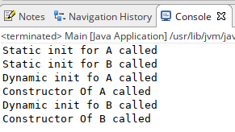

# Базовий синтаксис класу

## Java не підтримує перезавантаження операторів

Java не підтримує перезавантаження операторів - це вибір, який зробили його творці, які хотіли зробити мову простішою. Кожен оператор має хороший сенс завдяки арифметичній операції, яку виконує. Перевантаження оператора дозволяє зробити щось зайве, ніж те, на що очікується. Java дозволяє лише арифметичні операції на елементарних типах(+ String). Якщо ви дозволите розробнику робити перевантаження оператора, вони придумають декілька значень для одного оператора, що зробить криву навчання будь-якого розробника важкою, а речі ще більш заплутаними. Дизайнери Java хотіли завадити людям використовувати оператори в заплутаному вигляді.

# Методи класу Object

## toString()

**toString ()** надає рядкове представлення об'єкта і використовується для перетворення об'єкта в String. Метод toString () для класу Object повертає рядок, що складається з імені класу, об'єктом якого є екземпляр, символу `@ ' та шістнадцяткового відображення хеш-коду об'єкта. Іншими словами, він визначається як:

```java
public String toString()
{
    return getClass().getName() + "@" + Integer.toHexString(hashCode());
}
```

Завжди рекомендується перевизначити метод toString(), щоб отримати власне рядкове - представлення об'єкта.

Наприклад, використовуючи атрибути класу:

```java
class Student {
	
	private int id;
	private String name;
	private int cardId;
	
	public Student(int id, String name, int cardId) {
		super();
		this.id = id;
		this.name = name;
		this.cardId = cardId;
	}

	public int getId() {
		return id;
	}

	public void setId(int id) {
		this.id = id;
	}

	public String getName() {
		return name;
	}

	public void setName(String name) {
		this.name = name;
	}

	public int getCardId() {
		return cardId;
	}

	public void setCardId(int cardId) {
		this.cardId = cardId;
	}

	@Override
	public String toString() {
		return "Student [id=" + id + ", name=" + name + ", cardId=" + cardId + "]";
	}
}
```

## hashCode()

Для кожного об'єкта JVM генерує унікальне число, яке називається хеш-кодом. Він повертає окремі цілі числа для різних об'єктів. Поширене помилкове уявлення про цей метод полягає в тому, що метод **hashCode ()** повертає адресу об'єкта, що є невірним. Він перетворює внутрішню адресу об'єкта в ціле число за допомогою алгоритму. Метод **hashCode ()** є нативні, тому що в Java неможливо знайти адресу об'єкта, тому він використовує рідні мови, такі як C/C ++, щоб знайти адресу об'єкта.

Використання методу **hashCode ()**: Повертає хеш-значення, яке використовується для пошуку об’єкта в колекції. JVM (Java Virtual Machine) використовує метод хеш-коду під час збереження об'єктів у хешованих структурах даних, таких як HashSet, HashMap, Hashtable тощо. Основна перевага збереження об'єктів на основі хеш-коду полягає в тому, що пошук стає простим.

> Примітка: Перевизначення методу hashCode () потрібно зробити таким чином, що для кожного об'єкта ми генеруємо унікальне число. Наприклад, для класу "Студент" ми можемо повернути номер залікової книги, оскільки він унікальний.

Приклад:

```java

```

## equals(Object obj)

Порівняє переданий об’єкт із "this" об'єктом (об'єктом, щодо якого викликається метод). Це дає загальний спосіб порівняння об'єктів на рівність. Для отримання власної умови рівності потрібно перевизначити метод **equals (Object obj)**.

Стандартна реалізація:

```java

```

Приклад перевизначення **equals()**:

```java

```

## getClass()

???????????????

## finalize()

Цей метод викликається безпосередньо перед тим, як об’єкт буде знищенно. Колектор сміття викликає його на об'єкті, коли збирач сміття визначає, що більше немає посилань на об'єкт.

# Пакети

# Три принципи ООП

## Інкапсуляція

## Наслідування

### Наслідування - зло?

Наслідування - це хороший механізм, але потрібно розуміти проблеми з якими можна стикнутися використовуючи цей принцип ООП де попало.

Справа в тому, що наслідування не враховує майбутні зміни батьківського класу. Адже коли ви успадковуєте новий клас від існуючого, ви підписуєте контракт про те, що новий клас завжди буде вести себе як існуючий, можливо розширюючи його поведінку в деяких місцях. У мовах програмування такий ефект спостерігається за рахунок відсутності необхідності перевизначати публічні методи батьківського класу. А це означає, що їх з моменту успадкування можуть додати скільки завгодно і вам ніхто, включаючи компілятор, про це не скаже. А це, в свою чергу, може поламати вашу логіку успадкування з розширенням можливостей батьківського класу. Насправді варіанти є - написати модульний тест, який вважатиме кількість публічних і полупублічних методів і перевірить їх кількість. Це теж не дасть повної гарантії повідомлення, але вже краще. В ідеалі, варто було б при спадкуванні щоб уникнути сторонніх ефектів додавати тест, що фіксує сигнатури методів батьківського класу. Але хто це робить?

Це не всі мінуси успадкування. Коли у класу з'являється кілька спадкоємців, то у них є загальна поведінка, а є розширене. І часто доводиться морочитися з тестами, щоб уникнути дублікатів. Це вироджується в абстрактний тест, який кожен тест на дочірній клас повинен наслідувати. А що робити, якщо ви успадковуєте клас з сторонньої бібліотеки. В цьому випадку потрібно писати тести на базове поведінку, дублюючи існуючі тести в бібліотеці? Або варто залишити їх як "надійні" без тестів?

В Java не можна розірвати спадкування стану від успадкування поведінки. Виходить, що при бажанні наслідувати стан (набір полів і дії над ними) ви змушені тягнути за собою і всю поведінку, що призводить до небажаних ефектів при майбутніх змінах. Можливо, наявність інших типів даних на зразок структур вирішило б цю проблему.

Практично будь-яке використання успадкування можна замінити на композицію. Для цього потрібен лише інтерфейс. Тестувати стає значно простіше, гнучкості стає більше, повідомлення про зміни буде давати компілятор, код стає менш пов'язаним. Одні переваги! Чому ж так не роблять на практиці? Відповідь проста - через лінь. Набагато простіше додати ще одного спадкоємця і дописати рядок коду, перекривши один з методів. Це вимагає менших зусиль.

**Про те як замінити наслідування композицією ми поговоримо пізніше.**

## Поліморфізм

### Replace conditional with polymorphism

Такі конструкції як if,switch є елементами структурного програмування. Якщо ці конструкції зустрічаються у Вашому коді і створені для того, щоб виконувати рогалудження в залежності від типу об'єкта або його атрибуватів можна застосувати такий прийом як "Replace switch with polymorphism".

Розгляньмо наступний код:

```java
class SalesPerson {
	
	private int skill;
	public int getSkill() {
		return skill;
	}

	public void setSkill(int skill) {
		this.skill = skill;
	}

	public String getName() {
		return name;
	}

	public void setName(String name) {
		this.name = name;
	}

	private String name;
	
	public SalesPerson(String name, int skill) {
		this.name = name;
		this.skill = skill;
	}
	
	public double evalAdditionalSalary() {
		if (skill >= 0 && skill <= 5)
			return 150d;
		else
			if (skill > 5 && skill <= 10)
				return 300d;
		return 500d;
	}
}
```

Метод getSkillTitle в залежності від цілочисельного параметра skill повертає його рядкове представлення. Давайте змінимо наш код використовуючи "Replace conditional with polymorphism". Для цього:

- Створемо підкласи, яким відповідають відповідні гілки розгалудження.
- У підкласах створемо загальний метод і перенесіть відповідний код гілки із оригінального коду
- Замінемо умовний оператор викликом загального методу

```java
class SalesPerson {
	
	private int skill;
	public int getSkill() {
		return skill;
	}

	public void setSkill(int skill) {
		this.skill = skill;
	}

	public String getName() {
		return name;
	}

	public void setName(String name) {
		this.name = name;
	}

	private String name;
	
	public SalesPerson(String name, int skill) {
		this.name = name;
		this.skill = skill;
	}
	
	public double evalAdditionalSalary() {
		throw new java.lang.UnsupportedOperationException("Not supported yet.");
	}
}

class Junior extends SalesPerson {

	public Junior(String name, int skill) {
		super(name, skill);
	}
	
	public double evalAdditionalSalary() {
		return 150d;
	}
	
}

class Middle extends SalesPerson {

	public Middle(String name, int skill) {
		super(name, skill);
	}
	
	public double evalAdditionalSalary() {
		return 300d;
	}
	
}

class Senior extends SalesPerson {

	public Senior(String name, int skill) {
		super(name, skill);
	}
	
	public double evalAdditionalSalary() {
		return 500d;
	}
	
}

public class Main {

	public static void main(String[] args) {
		SalesPerson s = new Middle("Alex", 8);
		System.out.println(s.evalAdditionalSalary());
	}

}
```

> Хоча у прикладі ми використали для батьківського класу звичайний метод, який вказує, що він не доступний, краще використовувати або абстрактні класи, або інтерфейси.

# Порядок ініціалізації класів

Зараз наше завдання полягає в тому, щоб дізнатися в якому порядку ініціалізуються статичні, динамічні властивості, відбуваються виклики конструкторів в ієрархії класів. Для цього розгляньмо наступний приклад:

```java
class A {
	protected int a;
	
	public A(int a) {
		this.a = a;
		System.out.println("Constructor Of A called");
	}
	
	{
		System.out.println("Dynamic init fo A called");
	}
	
	static {
		System.out.println("Static init for A called");
	}
}

class B extends A {
	protected int b;
	
	public B(int a, int b) {
		super(a);
		this.b = b;
		System.out.println("Constructor Of B called");
	}
	
	{
		System.out.println("Dynamic init fo B called");
	}
	
	static {
		System.out.println("Static init for B called");
	}
	
}

public class Main {

	public static void main(String[] args) throws InterruptedException {
		B b = new B(2,2);
	}

}
```



З цього можна зробити висновок, що порядок ініціалізації класів наступний:

1. Статичні поля базового класу.
2. Статичний блок ініціалізації батьківського класу.
3. Статичні поля похідного класу.
4. Статичний блок ініціалізації похідного класу.
5. Поля базового класу.
6. Динамічний блок ініціалізації батьківського класу.
7. Конструктор базового класу.
8. Поля похідного класу.
9. Динамічний блок ініціалізації похідного класу.
10. Конструктор похідного класу.


# Абстрактні класи

# Інтерфейси

## Поліморфізм, використовуючи інтерфейси

# Абстрактні класи vs Інтерфейси

# Заміна наслідування композицією

# Enum

# Скільки пам'яті займають об'єкти

В java - everything is an object. Крім, мабуть, примітивів і посилань на самі об'єкти. Розгляньмо дві типові ситуації:

```java
int a = 300;
Integer b = 301;
```

У цих простих рядках різниця просто величезна, як для JVM так і для ООП. У першому випадку, все що у нас є - це 4-х байтна змінна, яка містить значення з стека. У другому випадку у нас є змінна  посилання і сам об'єкт, на який ця змінна посилається. Отже, якщо в першому випадку ми знаємо, що розмір змінної рівний:

```java
sizeOf(int)
```

То у другому випадку:

```java
sizeOf(reference) + sizeOf(Integer)
```

**Щоб дізнатися скільки займає об'єкт розгляньмо з чого він складається:**

- Заголовок об'єкта
- Пам'ять для примітивних типів
- Память для змінних посилань
- Зміщення / вирівнювання (по суті, це кілька невикористовуваних байт, що розміщуються після даних самого об'єкта. Це зроблено для того, щоб адреса в пам'яті завжди була кратниому машинному слову, для прискорення читання з пам'яті + зменшення кількості біт для покажчика на об'єкт + імовірно для зменшення фрагментації пам'яті. Варто також відзначити, що в java розмір будь-якого об'єкта кратний 8 байтам!)

**Розгляньмо детальніше структуру заголовка об'єкта.**

Кожен екземпляр класу містить заголовок. Кожен заголовок для більшості JVM (Hotspot, openJVM) складається з двох машинних слів. Якщо мова йде про 32-х розрядну систему, то розмір заголовка - 8 байт, якщо мова про 64-х розрядноу систему, то відповідно - 16 байт. Кожен заголовок може містити наступну інформацію:
- Маркувальне слово (mark word) - 
- Hash Code - кожен об'єкт має хеш код. За замовчуванням результат виклику методу Object.hashCode () поверне адресу об'єкта в пам'яті, проте деякі збирачі сміття можуть переміщувати об'єкти в пам'яті, але хеш код завжди залишається одним і тим же, так як місце в заголовку об'єкта якраз може бути використано для зберігання оригінального значення хеш коду.
- Garbage Collection Information - кожен java об'єкт містить інформацію потрібну для системи управління пам'яттю. Найчастіше це один або два біта-прапора, але також це може бути, наприклад, якась комбінація бітів для зберігання кількості посилань на об'єкт.
- Type Information Block Pointer - містить інформацію про тип об'єкта. Цей блок включає інформацію про таблиці віртуальних методів, покажчик на об'єкт, який представляє тип і покажчики на деякі додаткові структури, для більш ефективних викликів інтерфейсів і динамічної перевірки типів.
- Lock - кожен об'єкт містить інформацію про стан блокування. Це може бути покажчик на об'єкт блокування або пряме уявлення блокування.
- Array Length - якщо об'єкт - масив, то заголовок розширюється 4 байтами для зберігання довжини масиву.

**Розмір посилань.**

В принципі, розмір посилання в JVM залежить від її розрядності. Тому в 32-х розрядних JVM розмір посилання зазвичай 4 байта, а в 64-х розрядних - 8 байт. Хоча ця умова і не обов'язкова.

**Беручи до уваги всю цю інформацію, спробуймо приблизно розрахувати розмір об'єкта і порівняти розрахований розмір із дійсним, який нам покажи JVM:**

Розраховувати розмір ми будемо для наступного класу:

```java
class MyInt {
	private int value;
	
	public int getValue() {
		return value;
	}

	public void setValue(int value) {
		this.value = value;
	}

	public MyInt(int value) {
		this.value = value;
	}
}
```

Ітак, розмір об'єкта рівний:

```java
sizeOf(reference) + sizeOf(MyInt)
```

Припустимо, що наш код буде виконуватися на 64-х бітній платформі, тоді sizeOf(reference) - 8 байт. Тепер нам потрібно розрахувати sizeOf(MyInt), це доволі просто, кожен об'єкт містить заголовок, беручи до уваги розрядність це буде 16 байт. Наш клас містить всього-навсього одне примітивне поле, це ще 4 байти. Складаємо докупи: 8 + 16 + 4 = 28 байт.

Тепер дізнаймося дійсний розмір об'єкта, виконавши наступний код:

# Домашня робота

# Контрольні запитання