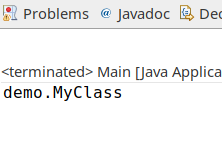
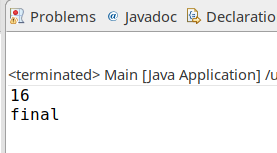
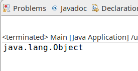
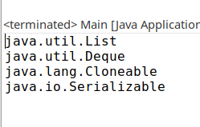
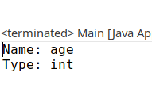
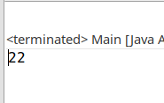
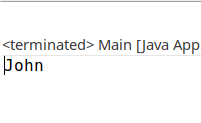
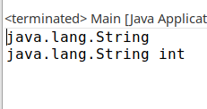

# Зміст

${toc}

# GC

Інформація в презентації

# Java Reflection API

**Рефлексія** (від Reflexio - звернення назад) - це механізм дослідження даних про програму у час, коли вона виконується.

Рефлексія дозволяє:
- Визначити клас об'єкта.
- Отримати інформацію про модифікатори класу, поля, методи, конструктори і суперклас.
- З'ясувати, які константи і методи належать інтерфейсу.
- Створити екземпляр класу, ім'я якого невідоме до моменту виконання програми.
- Отримати і встановити значення властивостей об'єкта.
- Викликати метод об'єкта.
- Створити новий масив, розмір і тип компонентів якого невідомі до моменту виконання програм.

## Отримання об'єкта типу Class

Найпростіше, що зазвичай роблять в динамічному програмуванні, - це отримують об'єкт типу java.lang.Class. Якщо у нас є екземпляр об'єкта Class ми можемо отримати всіляку інформацію про це класі і навіть здійснювати операції над ним.

```java
MyClass a = new MyClass(); 
Class aclass = a.getClass(); 
```

Вищенаведений метод getClass () часто корисний тоді коли є екземпляр об'єкта, але не відомо якого класу цей екземпляр. Якщо у нас є клас, для якого в момент компіляції відомий тип, то отримати екземпляр класу ще простіше.

```java
Class aclass = MyClass.class; 
Class iclass = Integer.class; 
```

Якщо ім'я класу не відомо в момент компіляції, але стає відомим під час виконання програми, можна використовувати метод forName (), щоб отримати об'єкт Class.

```java
Class c = Class.forName("com.mysql.jdbc.Driver");
```

## Отримання імені класу

```java
package demo;

class MyClass {}

public class Main {

	public static void main(String[] args) {
		MyClass class1 = new MyClass();
		Class klass = class1.getClass();
		String s = klass.getName();
		System.out.println(s);
	}
}
```

Об'єкт типу String, що повертається методом getName (), буде містити повністю уточнене ім'я класу.



## Визначення модифікаторів класу

```java
import java.lang.reflect.Modifier;

final class MyClass {}

public class Main {

	public static void main(String[] args) {
		MyClass class1 = new MyClass();
		Class klass = class1.getClass();
		String s = klass.getName();
		int mods = klass.getModifiers();
		System.out.println(mods);
		if (Modifier.isPublic(mods)) { 
		    System.out.println("public"); 
		} 
		if (Modifier.isAbstract(mods)) { 
		    System.out.println("abstract"); 
		} 
		if (Modifier.isFinal(mods)) { 
		    System.out.println("final"); 
		} 
	}
}
```



Щоб дізнатися, які модифікатори були застосовані до заданого класу, спочатку потрібно за допомогою методу getClass отримати об'єкт типу Class, який представляє даний клас. Потім потрібно викликати метод getModifiers () для об'єкта типу Class, щоб визначити значення типу int, біти якого представляють модифікатори класу. Після цього можна використовувати статичні методи класу java.lang.reflect.Modifier, щоб визначити, які саме модифікатори були застосовані до класу.

## Отримання суперкласу

```java
final class MyClass {}

public class Main {

	public static void main(String[] args) {
		MyClass class1 = new MyClass();
		Class klass = class1.getClass();
		Class super_class = klass.getSuperclass();
		System.out.println(super_class.getName());
	}
}
```



Можна також використовувати метод getSuperclass () для об'єкта Class, щоб отримати об'єкт типу Class, який представляє суперклас рефлексувати класу. Потрібно не забувати враховувати, що в Java відсутня множинне успадкування і клас java.lang.Object є базовим класом для всіх класів, внаслідок чого якщо у класу немає батька то метод getSuperclass поверне null. Для того щоб отримати всі батьківські суперкласу, потрібно рекурсивно викликати метод getSuperclass ().

## Визначення інтерфейсів, які реалізує класс

```java
import java.util.LinkedList;

public class Main {

	public static void main(String[] args) {
		Class c =  LinkedList.class; 
		Class[] interfaces = c.getInterfaces(); 
		for(Class cInterface : interfaces) { 
		    System.out.println( cInterface.getName() ); 
		} 
	}
}
```



## Отримання інформації про поля класу

```java
import java.lang.reflect.Field;

class Student {
	private String name = "Alex";
	public int age = 22;
}

public class Main {

	public static void main(String[] args) {
		Student s = new Student();
		Class c = s.getClass(); 
		Field[] publicFields = c.getFields(); 
		for (Field field : publicFields) { 
		    Class fieldType = field.getType(); 
		    System.out.println("Name: " + field.getName()); 
		    System.out.println("Type: " + fieldType.getName()); 
		} 
	}
}
```



Щоб дослідити поля належать класу, можна скористатися методом getFields () для об'єкта типу Class. Метод getFields () повертає масив об'єктів типу java.lang.reflect.Field, які відповідають усім відкритим полях об'єкта. Ці відкриті поля необов'язково повинні міститися безпосередньо всередині класу, з яким ви працюєте, вони також можуть містяться в суперкласі, інтерфейсі або інтерфейсі представляє собою розширення інтерфейсу, реалізованого класом. За допомогою класу Field можна отримати ім'я поля, тип і модифікатори. Якщо відоме ім'я поля, то можна отримати про нього інформацію за допомогою методу getField ()

```java
Class c = obj.getClass(); 
Field nameField = c.getField("name"); 
```

Методи getField () і getFields () повертають тільки відкриті члени даних класу. Якщо потрібно отримати всі поля деякого класу потрібно використовувати методи getDeclaredField () і getDeclaredFields (). Ці методи працюють точно також як їх аналоги getField () і getFields (), за винятком того, що вони повертають все поля, включаючи закриті і захищені. Щоб отримати значення поля, потрібно спочатку отримати для цього поля об'єкт типу Field потім використовувати метод get (). Метод приймає вхідним параметром посилання на об'єкт класу. Так само у класу Field є спеціалізовані методи для отримання значень примітивних типів: getInt (), getFloat (), getByte () і ін ..

```java
import java.lang.reflect.Field;

class Student {
	private String name = "Alex";
	public int age = 22;
}

public class Main {

	public static void main(String[] args) throws NoSuchFieldException, SecurityException, IllegalArgumentException, IllegalAccessException {
		Student s = new Student();
		Class c = s.getClass(); 
		Field ageField = c.getDeclaredField("age");
		int age = ageField.getInt(s);
		System.out.println(age);
	}
}
```



Для установки значення поля, використовується метод set (). Для примітивних типів є методи setInt (), setFloat (), setByte () і ін.

```java
import java.lang.reflect.Field;

class Student {
	private String name = "Alex";
	public String getName() {
		return this.name;
	}
	public int age = 22;
}

public class Main {

	public static void main(String[] args) throws NoSuchFieldException, SecurityException, IllegalArgumentException, IllegalAccessException {
		Student s = new Student();
		Class c = s.getClass(); 
		Field nameField = c.getDeclaredField("name");
		nameField.setAccessible(true);
		nameField.set(s, "John");
		nameField.setAccessible(false);
		System.out.println(s.getName());
	}
}
```



## Отримання інформації про конструктори

```java
import java.lang.reflect.Constructor;

class Student {
	public Student(String name) {}
	public Student(String name, int age) {}
}

public class Main {

	public static void main(String[] args) throws NoSuchFieldException, SecurityException, IllegalArgumentException, IllegalAccessException {
		Student s = new Student("qwe");
		Class c = s.getClass(); 
		Constructor[] constructors = c.getConstructors(); 
		for (Constructor constructor : constructors) { 
		    Class[] paramTypes = constructor.getParameterTypes(); 
		    for (Class paramType : paramTypes) { 
		        System.out.print(paramType.getName() + " "); 
		    } 
		    System.out.println(); 
		} 
	}
}
```



Щоб отримати інформацію про відкриті конструкторах класу, потрібно викликати метод getConstructors () для об'єкта Class. Цей метод повертає масив об'єктів типу java.lang.reflect.Constructor. За допомогою об'єкта Constructor можна потім отримати ім'я конструктора, модифікатори, типи параметрів і генеруються винятку. Можна також отримати за окремим відкритого конструктору, якщо відомі типи його параметрів.

```java
Class[] paramTypes = new Class[] { String.class, int.class }; 
Constructor aConstrct = c.getConstructor(paramTypes); 
```

Методи getConstructor () і getConstructors () повертають тільки відкриті конструктори. Якщо потрібно отримати всі конструктори класу, включаючи закриті можна використовувати методи getDeclaredConstructor () і getDeclaredConstructors () ці методи працюють точно також, як їх аналоги getConstructor () і getConstructors ().

## Отримання інформації про методи

```java
Class c = obj.getClass(); 
Method[] methods = c.getMethods(); 
for (Method method : methods) { 
    System.out.println("name: " + method.getName()); 
    System.out.println("type: " + method.getReturnType().getName()); 
 
    Class[] paramTypes = method.getParameterTypes(); 
    System.out.print("types of parameters: "); 
    for (Class paramType : paramTypes) { 
        System.out.print(" " + paramType.getName()); 
    } 
    System.out.println(); 
} 
```

Щоб отримати інформацію про відкриті методах класу, потрібно викликати метод getMethods () для об'єкта Class. Цей метод повертає масив об'єктів типу java.lang.reflect.Method. Потім за допомогою об'єкта Method можна отримати ім'я методу, тип повертається їм значення, типи параметрів, модифікатори і генеруються винятку. Також можна отримати інформацію по окремому методу якщо відомі ім'я методу і типи параметрів.

```java
Class c = obj.getClass(); 
Class[] paramTypes = new Class[] { int.class, String.class}; 
Method m = c.getMethod("methodA", paramTypes); 
```

Методи getMethod () і getMethods () повертають тільки відкриті методи, для того щоб отримати всі методи класу не залежно від типу доступу, потрібно мати можливість скористатися методами getDeclaredMethod () і getDeclaredMethods (), які працюють точно також як і їх аналоги (getMethod () і getMethods ()). Інтерфейс Java Reflection Api дозволяє динамічно викликати метод, навіть якщо під час компіляції ім'я цього методу невідомо (Імена методів класу можна отримати методом getMethods () або getDeclaredMethods ()). У наступному прикладі розглянемо виклик методу знаючи його ім'я. Наприклад метод getCalculateRating:

```java
Class c = obj.getClass(); 
Class[] paramTypes = new Class[] { String.class, int.class }; 
Method method = c.getMethod("getCalculateRating", paramTypes); 
Object[] args = new Object[] { new String("First Calculate"), new Integer(10) }; 
Double d = (Double) method.invoke(obj, args); 
```

В даному прикладі спочатку отримуємо об'єкт Method по імені методу getCalculateRating, потім викликаємо метод invoke () об'єкта Method, і отримуємо результат роботи методу. Метод invoke приймає два параметри, перший - це об'єкт, клас якого оголошує або успадковує даний метод, а другий - масив значень параметрів, які передаються викликається методу. Якщо метод має модифікатор доступу private, тоді вище наведений код потрібно модифікувати таким чином, для об'єкта Method замість методу getMethod () викликаємо getDeclaredMethod (), потім для отримання доступу викликаємо setAccessible (true).

```java
Method method = c.getDeclaredMethod("getCalculateRating", paramTypes); 
method.setAccessible(true);
```


# Annotations

# Домашнє завдання

## Варіанти

# Контрольні запитання